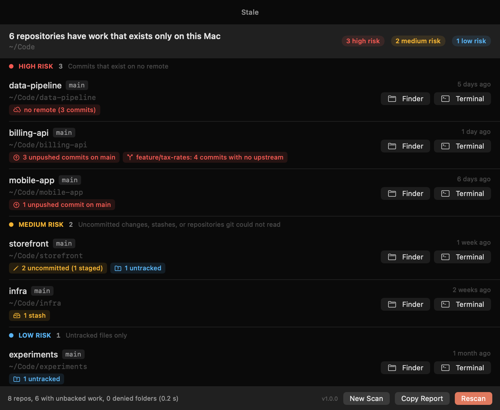

<p align="center">
  
</p>

<h1 align="center">Stale</h1>

<p align="center">
  <strong>Find the git work on your Mac that exists nowhere else.</strong>
</p>

<p align="center">
  <a href="https://github.com/mk24x7/stale/releases/latest"></a>
  <a href="https://github.com/mk24x7/stale/actions/workflows/ci.yml"></a>
  
  <a href="LICENSE"></a>
</p>

---

Stale answers one question: **what would I lose if this disk died right now?**

It walks your home folder (or any folder you pick), finds every git repository, and
lists the work that lives only on this Mac: uncommitted changes, untracked files,
commits you never pushed, branches with no upstream, stashes, and repositories with no
remote at all. Results are sorted by how much you stand to lose.

It comes as a native SwiftUI app and a `stale` command-line tool that share one engine.
No Electron, no network access, no telemetry, and it is **read-only**: Stale never
modifies a repository.

<p align="center">
  
</p>

## Install

Stale is open source and signed with an ad-hoc signature, not an Apple Developer ID.
Pick the install path that suits you.

**1. Homebrew, built from source (no Gatekeeper prompt)**

```bash
brew install mk24x7/tap/stale
ln -sfn "$(brew --prefix stale)/Stale.app" /Applications/Stale.app
```

This installs the `stale` command into your PATH and compiles `Stale.app` on your Mac,
so it carries no quarantine flag and opens without any security dialog. Needs Xcode 15
or later.

**2. Direct download**

Download `Stale-<version>-macos-universal.dmg` or `.zip` from the
[latest release](https://github.com/mk24x7/stale/releases/latest), verify it against
`SHA256SUMS.txt`, and copy `Stale.app` to `/Applications`. Then either:

- open it once, click **Done** in the "Apple could not verify" dialog, go to
  **System Settings > Privacy & Security**, scroll to **Security** and click
  **Open Anyway** (macOS 15 and 26 no longer offer the Control-click shortcut), or
- clear the quarantine flag from Terminal:

```bash
xattr -d com.apple.quarantine /Applications/Stale.app
```

The command-line tool alone is in `stale-<version>-macos-universal.tar.gz`:

```bash
tar -xzf stale-<version>-macos-universal.tar.gz
xattr -d com.apple.quarantine stale-<version>-macos-universal/stale
sudo mv stale-<version>-macos-universal/stale /usr/local/bin/
```

**3. Homebrew cask (prebuilt app, quarantined)**

```bash
brew install --cask mk24x7/tap/stale-app
```

Homebrew no longer strips quarantine, so this path shows the same first-launch dialog
as the direct download. Use it if you manage your Mac with `brew bundle`.

**4. Build from source**

```bash
git clone https://github.com/mk24x7/stale.git && cd stale
./build.sh          # builds dist/Stale.app and dist/stale, ad-hoc signed
./package.sh        # optional: zip, dmg, CLI tarball and checksums
```

## What it detects

| Finding | Risk | What it means | git command |
| --- | --- | --- | --- |
| No remote (`noremote`) | high | The repository has commits and no remote at all. Every commit exists only here. | `git remote`, `git rev-list --count --branches` |
| Unpushed (`unpushed`) | high | A branch is ahead of its remote-tracking upstream by N commits. | `git for-each-ref --format='%(upstream:track)' refs/heads` |
| No upstream (`noupstream`) | high | A local branch has no upstream, or its upstream was deleted, and holds commits that no remote-tracking branch contains. Also covers commits made on a detached HEAD. | `git for-each-ref refs/heads`, `git rev-list --count <branch> --not --remotes` |
| Uncommitted (`uncommitted`) | medium | Modified, staged, deleted, renamed or conflicted tracked files. | `git status --porcelain=v2 --branch` |
| Stash (`stash`) | medium | Entries in the stash. Stashes are never pushed. | `git stash list --format=%gd` |
| Untracked (`untracked`) | low | Files git neither tracks nor ignores. Git collapses an untracked folder into one entry. | `git status --porcelain=v2 --branch` |
| Unreadable (`unreadable`) | medium | git could not read the repository: a corrupt `.git`, a `.git` file pointing nowhere, a repository owned by another user, or a command that timed out. | `git rev-parse` |

Repositories are sorted with the heaviest finding first: no remote, then unpushed
commits and branches without upstream, then uncommitted changes, stashes and untracked
files. A branch that is only *behind* its upstream is not a finding: nothing would be
lost.

## Read-only by design

Stale never changes anything. It does not commit, stash, push, fetch, prune, delete or
rewrite; there is no button or flag that does. Specifically:

- It runs only `git status`, `git for-each-ref`, `git stash list`, `git remote`,
  `git rev-list` and `git rev-parse`, as argument arrays passed to `/usr/bin/git`,
  never through a shell.
- Every call sets `GIT_OPTIONAL_LOCKS=0`, so `git status` never refreshes or rewrites
  the index, and disables `core.fsmonitor` and the pager so no helper process is
  started from a repository's configuration.
- `GIT_CEILING_DIRECTORIES` pins each command to the repository being inspected, so a
  broken repository is reported as unreadable instead of silently being replaced by an
  enclosing one.
- It never contacts a remote. Findings are computed against your remote-tracking
  branches as of your last `git fetch`.
- Each git command has a 20 second timeout; at most eight repositories are inspected at
  once.

The test suite checks that a scan leaves every file inside `.git` byte-for-byte and
timestamp-for-timestamp unchanged.

## CLI reference

```
stale [path] [options]

Arguments:
  path                  Folder to scan (default: your home folder)

Options:
  --json                Print one JSON document instead of text
  --only <list>         Comma-separated finding types to report:
                        unpushed, uncommitted, untracked, stash,
                        noremote, noupstream
  --min-risk <level>    Only report findings at or above: low, medium, high
                        (default: low)
  --nested              Also report repositories nested inside other repositories
  --max-depth <n>       Maximum folder depth below path (default: 10)
  --no-color            Disable colours (NO_COLOR is also honoured)
  -V, --version         Show the version
  -h, --help            Show this help
```

Text output is one line per repository, highest risk first, followed by a summary:

```
$ stale ~/code
HIGH  ~/code/side-project [main]  no remote (14 commits)
HIGH  ~/code/api-server [feature/login]  2 unpushed commits on main, 1 uncommitted
MED   ~/code/dotfiles [main]  3 uncommitted (1 staged)
MED   ~/code/website [main]  1 stash, 1 untracked
LOW   ~/code/notes [main]  2 untracked

41 repos, 5 with unbacked work, 0 denied folders (1.8 s)
```

Colours are used only when standard output is a terminal. `--json` prints a single
document with `summary`, `repositories` (the at-risk ones, each with its `findings`),
`clean` (paths with nothing at risk) and `denied` (folders that could not be read).

### Exit codes

| Code | Meaning |
| --- | --- |
| 0 | Nothing at risk (after `--only` and `--min-risk` are applied) |
| 1 | Runtime error, for example git is missing |
| 2 | Usage error: unknown option, bad value, or a path that is not a folder |
| 3 | At-risk work found |

So it slots into scripts, for example before wiping a machine:

```bash
stale ~ --min-risk high || echo "Push your work first"
```

## What it scans

- The walk starts at the folder you choose (default: home) and goes at most 10 levels
  deep.
- Under your home folder it skips `Library`, `Applications`, `.Trash`, `Pictures`,
  `Movies`, `Music` and tool caches such as `.cargo`, `.npm` and `.cache`.
- Everywhere it skips `node_modules`, `.build`, `target`, `vendor`, `Pods`, `venv`,
  `.venv`, `__pycache__` and `DerivedData`, app bundles, and symbolic links.
- Hidden folders are otherwise scanned, because dotfile repositories (`~/.dotfiles`,
  `~/.config/nvim`) are exactly the kind of thing people forget to push.
- Folders it is not allowed to read are counted and reported, never silently dropped.

## FAQ

**Does it handle worktrees?** Yes. A linked worktree (a folder whose `.git` is a file)
is reported on its own line with its own uncommitted and untracked files. Branches,
stashes and remotes are shared by all worktrees of a repository, so when the main
working tree is also inside the scanned folder those findings are reported once, on the
main repository. If the main repository is outside the scanned folder, the worktree
carries them. Bare repositories are found too, and a bare repository without a remote
is reported as having no remote: it is exactly as fragile as your disk.

**What about nested repositories?** Once Stale finds a repository it does not look
inside it, so vendored checkouts and submodules are not reported separately by default.
Use `--nested` (or the "Include nested repos" toggle in the app) to report repositories
that live inside another repository's working tree.

**Why does it not push for me?** Deciding what to push, where, and whether a branch
should exist at all needs a human. A tool that pushes or stashes on your behalf can
publish secrets or half-finished work to the wrong remote. Stale shows you the list;
"Open in Terminal" puts you in the repository to deal with it.

**Is it fast on a big home folder?** The walk only lists directories and skips
dependency folders, caches and `~/Library`, and git runs for at most eight repositories
at a time. On the author's Mac a full home-folder scan (about 13,000 folders and 115
repositories) takes under 10 seconds. Very large working trees with many untracked
files are the slowest part, which is why each git command
has a 20 second timeout; a repository that exceeds it is reported as unreadable rather
than stalling the scan.

**Why is my repository reported as unreadable?** Run `git status` inside it. Common
causes are a `.git` file left behind by a deleted worktree, a repository owned by
another user (git's "dubious ownership" check), or a corrupt `.git` folder.

**Do I need Full Disk Access?** No. macOS asks once per protected folder (Desktop,
Documents, Downloads). Folders you decline are counted as "could not be read".

**Why the Gatekeeper dialog?** Stale is not notarized because it is a free, open-source
side project and Apple's Developer Program costs 99 USD a year. The Homebrew formula
avoids the dialog entirely by compiling on your machine.

## Contributing

See [CONTRIBUTING.md](CONTRIBUTING.md). New finding types need a test that builds the
situation with real git commands. Security issues: [SECURITY.md](SECURITY.md).

Stale is a sibling of [Prune](https://github.com/mk24x7/prune), which finds and removes
regenerable build artifacts.

## License

[MIT](LICENSE)
